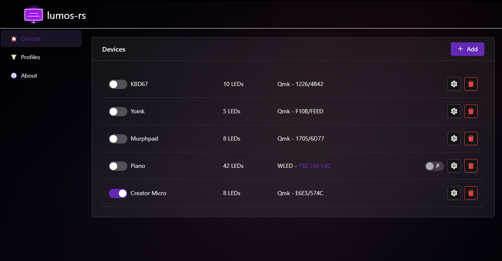
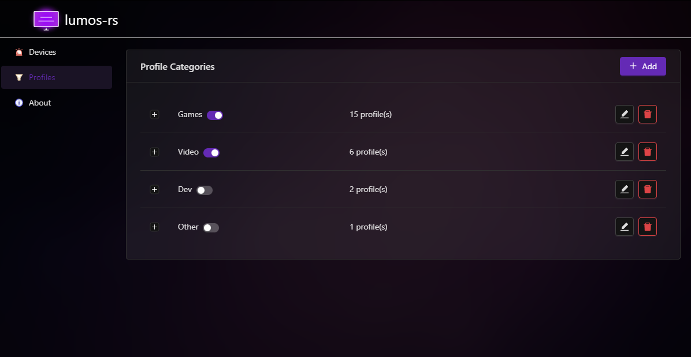

# lumos-rs

lumos-rs is an [Ambilight](https://en.wikipedia.org/wiki/Bias_lighting) implementation in Rust, with a tauri-react
frontend. The idea is similar to [hyperion-ng](), with significantly less configuration, but with some extra features
such as audio reactivity and application- or game-specific profiles.

The application can output color data to network devices running [WLED](https://github.com/Aircoookie/WLED) and
keyboards running [QMK](https://qmk.fm/).

## Screenshots

